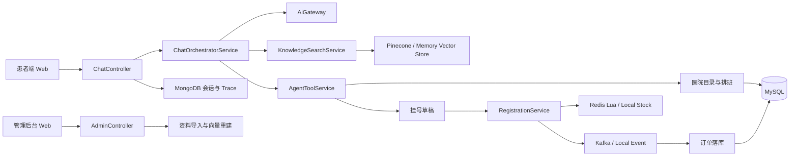

# 架构说明

## 总览

Intelligent Doctor 采用 Spring Boot 单体后端 + 静态患者端/管理后台页面。后端按业务边界拆分为导诊编排、知识库、挂号、聊天历史、后台导入和基础设施适配层。

## 核心模块

- `ai`: OpenAI 兼容模型接入、规则兜底模型、提示词上下文、工具建议。
- `chat`: SSE 流式导诊入口，串联 AI 分析、RAG、工具调用和历史记录。
- `knowledge`: 医院知识切分、持久化、内存/Pinecone 向量库适配和检索。
- `catalog`: 医院、科室、诊室、医生、排班和挂号规则查询。
- `registration`: 挂号草稿、库存预占、事件发布、订单落库和幂等确认。
- `admin`: 医院资料导入、任务状态、失败重试、向量索引重建。
- `system`: MySQL、MongoDB、Redis、Kafka、OpenAI、Pinecone 状态检查。

## 关键链路

1. 患者输入症状。
2. `ChatOrchestratorService` 调用 `AiGateway` 得到症状归纳、可能方向、推荐科室和风险提示。
3. 挂号模式下调用 `KnowledgeSearchService` 做 RAG 召回，并记录 `ragSearch` 工具 Trace。
4. `AgentToolService` 查询科室、诊室、医生和排班，自动生成挂号草稿。
5. SSE 输出 `meta`、`chunk`、`result` 或 `error` 事件。
6. 用户确认挂号后，`RegistrationService` 执行库存预占。
7. Redis 模式通过 Lua 原子 `GET` + `DECRBY` 防止热点号源超卖。
8. 预占成功后发布本地或 Kafka 事件，由 `RegistrationOrderPersistenceService` 幂等落订单。

## 数据存储

- MySQL: 医院主数据、排班、挂号规则、导入任务、挂号草稿、挂号订单、知识分块。
- MongoDB: 会话、消息、Prompt Trace、Tool Trace。
- Redis: 号源库存 Key、预占 Token。
- Kafka: 挂号预占成功事件，可切换成本地同步事件。
- Pinecone: 正式向量检索；测试和本地离线演示可使用内存向量库。
